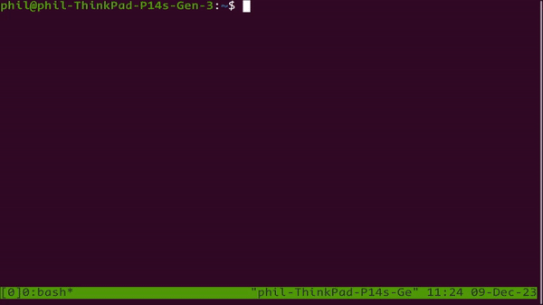

# tmux-toggl
A Tmux plugin for interacting with the Toggl time tracker


## Features

* Show the running time entry
* Start a time entry from a list of recent time entries
* Type the running time entry into Tmux (great for writing emails, git branches, comments etc.)

## Preview




## Dependencies

* [Toggl CLI](https://github.com/AuHau/toggl-cli)

* [fzf](https://github.com/junegunn/fzf)

# Installation

1. Using [TPM](https://github.com/tmux-plugins/tpm), add the following line to your `~/.tmux.conf` file:

```bash
set -g @plugin 'philjnicholls/tmux-toggl'
```

> **Note**: The above line should be _before_ `run '~/.tmux/plugins/tpm/tpm'`

2. Then press `tmux-prefix` + <kbd>I</kbd> (capital i, as in **I**nstall) to fetch the plugin as per the TPM installation instructions

## Usage

### Default keybindings

- `<tmux-prefix> T` to show the running time entry
- `<tmux-prefix> t` to start a new time entry from a list of recent time entries
- `<tmux-prefix> l` to type the running time entry into Tmux

## Configuration

The default configuration:

```bash
set -g @tmux-toggl-extra-time-entries "" # Comma seperated list of time entry titles to add to the recent list (eg. "Live issues,General")
set -g @tmux-toggl-running-time-entry-key "T"
set -g @tmux-toggl-start-recent-time-entry-key "t"
set -g @tmux-toggl-send-keys-running-time-entry "l"
set -g @tmux-toggl-daily-hours "7" # Number of hours used to create projected hours
set -g @tmux-toggl-togglcli-options "" # Command line options for TogglCli
set -g @tmux-toggl-weekdays "01234" # List of weekdays that are considered working days for projected hours (0 = Mon, 1 = Tue etc.)
```

## References

https://github.com/tmux-plugins
https://github.com/tmux-plugins/tmux-example-plugin
https://github.com/tmux-plugins/tmux-battery

## License

[GNU GENERAL PUBLIC LICENSE](https://github.com/philjnicholls/tmux-toggl/blob/master/LICENSE.md)
